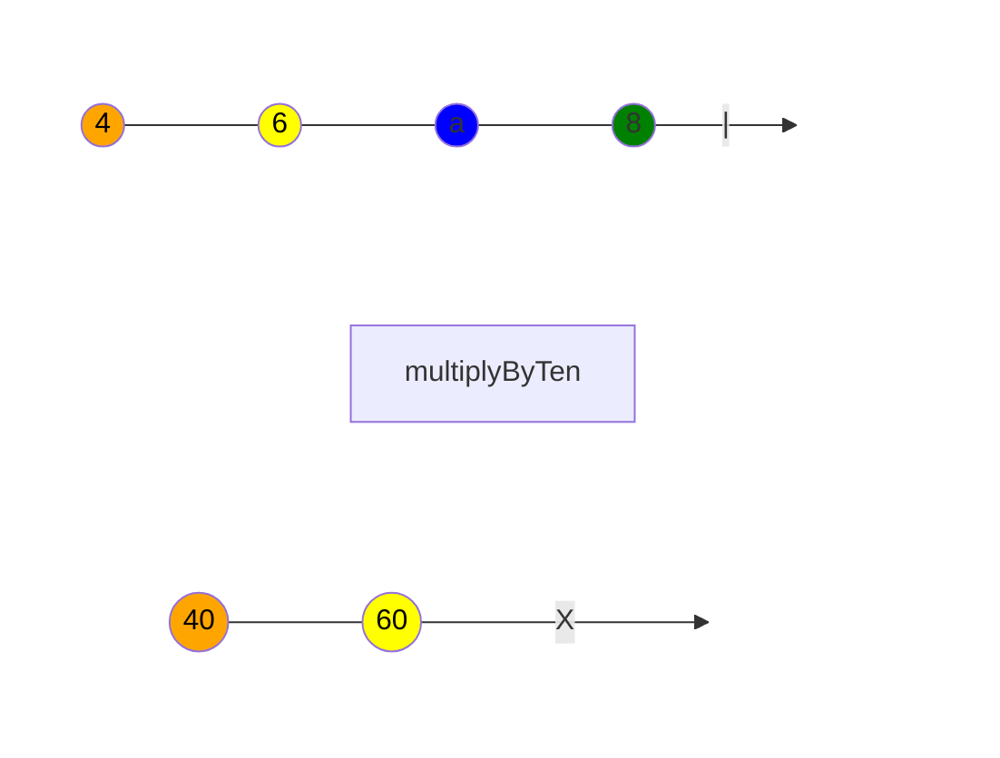

# Operators

就算 Observable 是 RxJS 的基底，但最好用的還是它一系列的運算子，運算子是很重要的一部分，它能夠以聲明的方式輕易地組成相當複雜的非同步程式碼。

- [Operators](#operators)
  - [什麼是運算子？](#什麼是運算子)
  - [串接](#串接)
  - [創建運算子](#創建運算子)
  - [高階 Observables](#高階-observables)
  - [彈珠圖](#彈珠圖)
  - [運算子的種類](#運算子的種類)
    - [創建運算子](#創建運算子-1)
    - [聯合創建運算子](#聯合創建運算子)
    - [變形運算子](#變形運算子)
    - [聯合運算子](#聯合運算子)
    - [群播運算子](#群播運算子)
    - [錯誤處理運算子](#錯誤處理運算子)
    - [通用運算子](#通用運算子)
    - [條件和布林運算子](#條件和布林運算子)
    - [數學和統計運算子](#數學和統計運算子)
  - [客製化運算子](#客製化運算子)
    - [使用 `pipe()` 製作新的運算子](#使用-pipe-製作新的運算子)
    - [從零開始~~的異世界生活~~建立運算子](#從零開始的異世界生活建立運算子)

## 什麼是運算子？

運算子是函式，它有兩種類型：

-   **管道運算子 Pipeable Operators**

    管道運算子是一種可以通過 `observableInstance.pipe(operator)`（或是更常見的 `observableInstance.pipe(operatorFactory())`）語法來串接 Observable 的一種函式，而運算子工廠包括 `filter(...)` 與 `mergeMap(...)`。

    當管道運算子被呼叫時，它們不會改變現存的 Observable 實例，取而代之的是，它們會返回新的 Observable，而新的 Observable 的訂閱邏輯也會基於原始的 Observable。

    > 管道運算子是一個會將 Observable 作為它的輸入的函式，並且會返回新的 Observable。管道運算子同時是一個純函式，先前的 Observable 並不會被它給編輯。

    > 管道運算子工廠是一個可以接收參數來改變上下文的函式，並且會返回一個管道運算子，該工廠的參數會屬於運算子的語彙範疇。

    管道運算子最重要的觀念是，**它是一個純函式**，並接收一個 Observable 作為輸入，並產生另一個 Observable 作為輸出，當訂閱輸出的 Observable 的同時也會訂閱輸入的 Observable。

-   **創建運算子 Creation Operators**

    創建運算子是另一種類型的運算子，它可以單獨被呼叫來建立新的 Observable 更詳細的說明會在後面區塊提及。

    例如，`of(1, 2, 3)` 會建立一個會依序發送 `1`、`2`、`3` 的 Observable，再透過 `map` 管道運算子，將每個值平方，最後將輸出 `1`、`4`、`9`：

    > `map` 與陣列方法同名且類似功能的一個函式。

    ```js
    import { of, map } from "rxjs";

    of(1, 2, 3)
        .pipe(map((x) => x * x))
        .subscribe((v) => console.log(`value: ${v}`));

    // 輸出
    // value: 1
    // value: 4
    // value: 9
    ```

    而另外有一個實用的函式叫 `first`：

    ```js
    import { of, first } from "rxjs";

    of(1, 2, 3)
        .pipe(first())
        .subscribe((v) => console.log(`value: ${v}`));
    ```

    從邏輯上來說，`map` 必須動態建構（呼叫），因為需要提供映射函數作為參數給它，而相比之下，`first` 可以是一個常數，意味著它並沒有強制需要傳入任何參數，但仍然是動態建構的。

    一般來說，所有運算子都必須有建構（呼叫）的動作，無論它是否需要參數。

## 串接

管道運算子都是函式，所以它們可以像一般函式調用（例如：`op()(obs)`，而 `obs` 代表著 Observable），但實務上來說，存在多組運算子時，它們彼此之間比起串接，更像是互相嵌套，並且程式碼會在嵌套的過程中逐漸變得不可讀（例如：`op4()(op3()(op2()(op1()(obs))))`），正因如此，Observables 才有一個方法 `.pipe()`，增加程式碼可讀性的同時也確保功能上能完成相同的嵌套需求：

```js
obs.pipe(op1(), op2(), op3(), op4());
```

而從風格的角度切入，`op()(obs)` 這種做法永遠不要使用，就算你只對 Observable 使用一個運算子。

## 創建運算子

與管道運算子不同，創建運算子是可以用來建立 Observable，這個 Observable 會有著預先定義的行為，或是與其它 Observable 結合。

一個典型的範例，就是 `interval` 運算子，它需要一個數字作為參數，然後會返回一個 Observable：

```js
import { interval } from "rxjs";

const observable = interval(1000 /** ms */);
```

## 高階 Observables

最常見的情況下，Observables 會發送一般的值像是 `string` 或 `number`，但令人驚訝的是，需要處理到 Observables 中的 Observables 的情境卻很常見，也就是所謂的高階 Observables。

例如，想像一下，你有一個會發送多組檔案的 URL 的 Observables，程式碼可能會像下面這樣：

```js
const fileObservable = urlObservable.pipe(map((url) => http.get(url)));
```

`http.get()` 會根據各個 URL 返回一個 Observable，這時你就有了高階 Observables 了。

那要怎麼處理高階 Observables 呢？典型的處理方式是透過扁平化，將高階的 Observables 轉換成一般的 Observables，例如說：

```js
const fileObservable = urlObservable.pipe(
    map((url) => http.get(url)),
    concatAll()
);
```

`concatAll()` 運算子會訂閱來自「外層」 Observable 內的每個「內部」的 Observable，並複製所有被發送的值，直到那個 Observable 結束，然後再往下一個 Observable，所有的值都是透過這種方式串連。

其他一些實用的運算子有：

-   `mergeAll()`：在每個內部 Observable 到達時訂閱它，然後在每個值到達時將它發出。
-   `switchAll()`：在第一個個內部 Observable 到達時訂閱它，然後在每個值到達時將它發出，但當下一個 Observable 抵達時，會取消訂閱上一個 Observable，改為訂閱剛抵達的 Observable。
-   `exhaustAll()`：在第一個個內部 Observable 到達時訂閱它，然後在每個值到達時將它發出，會在第一個 Observable 結束前拋棄掉其他抵達的 Observable，然後等待新的內層 Observable 到來。

如同許多陣列函式庫將 `map()` 和 `flat()`（或 `flatten()`）組合成一個 `flatMap()` 一樣，所有 RxJS 扁平化運算子 `concatMap()`、`mergeMap()`、`switchMap()` 和 `exhaustMap` 都在映射上等效。

## 彈珠圖

單憑文字敘述是無法充分解釋運算子是如何運作的，許多運算子都與時間有關連性，例如說它們可能會以不同方式來發送值，像是延遲（delay）、節流（throttle）、去彈跳/防抖（debounce），這時圖表就會是一個比較好的呈現方式。

彈珠圖是一種視覺化表示法，可以呈現運算子的運作方式，囊括了像輸入的 Observables、其他運算子與其參數、還有輸出的 Observable 等資訊。

> 在彈珠圖中，時間由左至右遞增，並且圖表描述了在 Observable 執行時，值（彈珠）是怎麼被發送的。

下方是一個彈珠圖：



每一條由左指向右的線，都代表著一個 Observable 的執行，線上各個不同顏色的節點是 Observable 隨著時間流動會一一發送的值（Next），垂直線帶表 Complete 通知，表明了該 Observable 已成功結束，最後叉叉代表 Error 通知，明確示意該 Observable 不正常地結束，並不再有值被發送。

再來是中間的方塊，方塊代表著一個運算子，內部文字敘述是它所做的事情，就像上面範例中的方塊會將值都乘以 10，然後方塊與上下兩個 Observable 之間的關係是，方塊會將上方的 Observable 作為運算子的輸入，而下方的 Observable 就是運算子的輸出。

## 運算子的種類

運算子非常多樣，功能也是五花八門，但總體來說可以被歸納為幾種類型：創建（creation）、變形（transformation）、過濾（filtering）、聯合（joining）、群播（multicasting）、錯誤處理（error handling）、通用（utility）...等等，下面的清單會按照分類去歸納運算子：

### 創建運算子

-   `ajax`
-   `bindCallback`
-   `bindNodeCallback`
-   `defer`
-   `empty`
-   `from`
-   `fromEvent`
-   `fromEventPattern`
-   `generate`
-   `interval`
-   `of`
-   `range`
-   `throwError`
-   `timer`
-   `iif`

### 聯合創建運算子

這些同樣是創建運算子，但具有加入其他 Observable 的功能，像是發送來自多個 Observables 的值。

-   `combineLatest`
-   `concat`
-   `forkJoin`
-   `merge`
-   `partition`
-   `race`
-   `zip`

### 變形運算子

-   `buffer`
-   `bufferCount`
-   `bufferTime`
-   `bufferToggle`
-   `bufferWhen`
-   `concatMap`
-   `concatMapTo`
-   `exhaust`
-   `exhaustMap`
-   `expand`
-   `groupBy`
-   `map`
-   `mapTo`
-   `mergeMap`
-   `mergeMapTo`
-   `mergeScan`
-   `pairwise`
-   `partition`
-   `pluck`
-   `scan`
-   `switchScan`
-   `switchMap`
-   `switchMapTo`
-   `window`
-   `windowCount`
-   `windowTime`
-   `windowToggle`
-   `windowWhen`

### 聯合運算子

可以另外參考上面的[聯合創建運算子](#聯合創建運算子)。

-   `combineLatestAll`
-   `concatAll`
-   `exhaustAll`
-   `mergeAll`
-   `switchAll`
-   `startWith`
-   `withLatestFrom`

### 群播運算子

-   `multicast`
-   `publish`
-   `publishBehavior`
-   `publishLast`
-   `publishReplay`
-   `share`

### 錯誤處理運算子

-   `catchError`
-   `retry`
-   `retryWhen`

### 通用運算子

-   `tap`
-   `delay`
-   `delayWhen`
-   `dematerialize`
-   `materialize`
-   `observeOn`
-   `subscribeOn`
-   `timeInterval`
-   `timestamp`
-   `timeout`
-   `timeoutWith`
-   `toArray`

### 條件和布林運算子

-   `defaultIfEmpty`
-   `every`
-   `find`
-   `findIndex`
-   `isEmpty`

### 數學和統計運算子

-   `count`
-   `max`
-   `min`
-   `reduce`

## 客製化運算子

### 使用 `pipe()` 製作新的運算子

> 此 `pipe` 非 `observable.pipe`，需要另外從套件引入。

若是再程式碼中有常用的運算子序列，可以用 `pipe()` 將這個序列單獨抽離變成一個新的運算子，就算運算子序列的複用性不是那麼高情況，也可以嘗試將較複雜的序列抽離出來變成一個運算子來增加可讀性。

舉例來說，下面是一個會過濾掉奇數值，並將偶數值平方的客製化運算子：

```js
import { pipe, filter, map } from "rxjs";

function discardOddDoubleEven() {
    return pipe(
        filter((v) => !(v % 2)),
        map((v) => v * v)
    );
}
```

### 從零開始~~的異世界生活~~建立運算子

要從零打造一個運算子比較複雜，而且情況較為少見，但還是能透過 `Observable` 類別辦到，下面是一個延遲的運算子範例：

```ts
import { Observable } from "rxjs";

function delay<T>(ms: number) {
    // 還記得在 #串接 章節有提到，管道運算子都是函式，而且會接收前一個 Observable 嗎？
    // 所以這邊需要 Observable 作為輸入參數
    return (observable: Observable<T>) =>
        // 當然，也要有一個輸出的 Observable，並且要是新的
        new Observable<T>((subscriber) => {
            const allTimerIDs = new Set();
            let hasCompleted = false;

            // 再來要訂閱輸入的 Observable 來獲取傳遞過來的值
            // 接著要在 Observer 中實踐 Observable 三種通知類型的回調函式
            // 回調函式就會有你這個客製化運算子的業務邏輯
            const subscription = observable.subscribe({
                next(value) {
                    const timerID = setTimeout(() => {
                        subscriber.next(value);
                        allTimerIDs.delete(timerID);
                        if (hasCompleted && !allTimerIDs.size)
                            subscriber.complete();
                    }, ms);

                    allTimerIDs.add(timerID);
                },
                error(err) {
                    subscriber.error(err);
                },
                complete() {
                    hasCompleted = true;
                    if (!allTimerIDs.size) subscriber.complete();
                },
            });

            // 最後記得返回一個清除（處置）函式
            // 它會在 Observable 錯誤、結束、或被取消訂閱時調用
            return () => {
                subscription.unsubscribe();

                for (const timerID of allTimerIDs) {
                    clearTimeout(timerID);
                }
            };
        });
}
```
